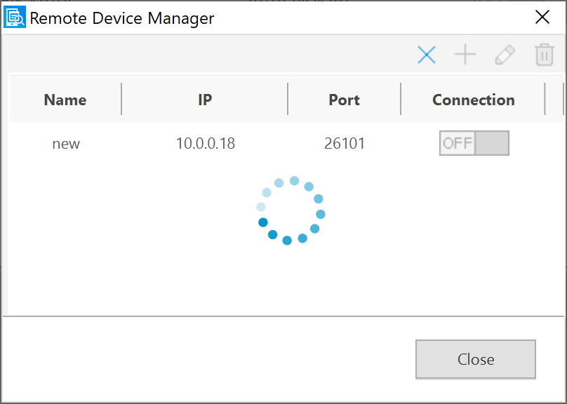

# How to run Tizen Samsung Gear emulator with a real android phone
**(You need to follow this EXACT steps for it to run properly)**

1. Download the [**Host manager for Emulator**](https://developer.samsung.com/galaxy-watch-develop/creating-your-first-app/web-companion/galaxy-watch-emulator.html?download=/glxywatchdevelop/file/e8304d30-cd46-4391-8ac1-ba24364c1f50#).
2. Connect your phone to the PC through USB.
3. Unzip the file and then run this command `adb install -r SAAccessoryService_Emul.apk` to install the host manager on to your phone. **You need to have your Android sdk on envrionment variable to run adb on cmd line. Here is a [guide](https://developer.android.com/studio/command-line/variables) on how to set it up**
3. Run this command `adb -d forward tcp:8230 tcp:8230`. At this point only the cmd line should be open.
4. Open the Host manager for emulator on your phone.
5. In Tizen Studio, run the emulator. **The emulator NEEDS to be on version 3.0 and make sure you have Samsung Wearable Extension and Samsung Certificate Extension installed through the package manager**
6. After the emulator boots up all the way, the host manager should display connected on screen. 

# Things to check if the emulator is refusing to connect to the phone

1. Double check to make sure that the _**emulator version is 3.0**_ or earlier and that the _**Samsung Wearable and Certificate Extensions**_ are installed.
2. Try creating a brand new emulator (keeping the settings the same). This almost always fixed my issues. 
3. Check out [**this**](https://forum.developer.samsung.com/tcannot-link-between-watch-emulator-and-smartphone-physical-device/319/5) post on Samsung forums. This person had a similar problem to mine and this is what I followed to resolve my issues. I predict that most of the people will have similar issues as this person. 
4. If you are still having issues, feel free to contact me at blee11@uw.edu!

# How to connect Samsung Smart Watches to Tizen Studio IDE

1. Turn on WIFI on the smart watch. **(WIFI on smart watch needs to be the same as the PC)**
2. Turn on developer mode by going to **settings -> About watch -> scroll all the way down to "turn debugging on".** Now the phone is ready to connect to Tizen studio.
3. Open up Tizen studio and open Device manager by going to tools -> device manager.
4. In device manager, follow the screenshot below to open up remote device manager.

5. In remote device manager, your watch should appear on the remote device manager as seen below.

6. If your watch does not show up, hit the refresh button on the top right corner as shown below.

7. Make sure to change the device that you are using by clicking on the tab shown below.

